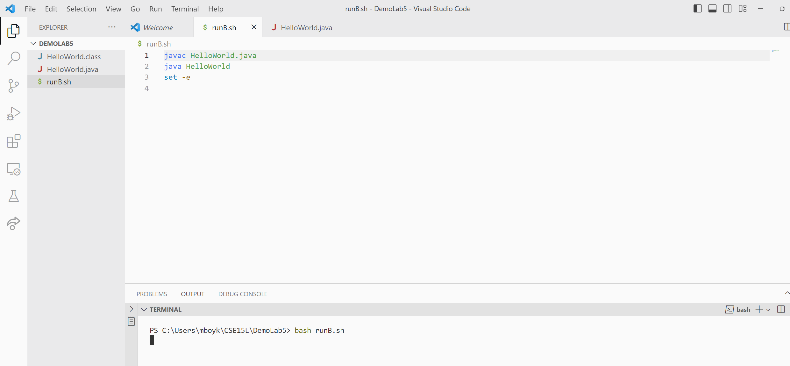

# Lab 5
## Here is the theoretical EdPost that would be posted by a student:

## What environment are you using (computer, operating system, web browser, terminal/editor, and so on)?
I am using a Laptop LG Gram which operates on Windows 11. I am using the VSCode editor with java 17.0.5 2022-10-18 LTS.


## Detail the symptom you're seeing. Be specific; include both what you're seeing and what you expected to see instead. Screenshots are great, copy-pasted terminal output is also great. Avoid saying “it doesn't work”.
When I type the command ```bash runB.sh``` which should run the bash script, the terminal crashes. All I have in the bash script is the compile and running of a java file I've called "HelloWorld". The java file 
prints "Hello World" perfectly to the terminal when I run the compiling and running commands seperately, but when I try and use the bash script, the terminals crashes. 



## Detail the failure-inducing input and context. That might mean any or all of the command you're running, a test case, command-line arguments, working directory, even the last few commands you ran. Do your best to provide as much context as you can.
I'm in the PS C:\Users\mboyk\CSE15L\DemoLab5> working directory which houses the HelloWorld.java and the runB.sh script. I run the bash script in the working directory, and it fails. I tried
running the bash script before and after manually compiling the java file, but in either case the terminal crashes.
Thanks for any help!
Misha

# 1. TA Response:
Hello Misha, 
I'm looking at your terminal, and I noticed that although it says "bash" on the right side of the terminal screen, your working directory is given in similar form to that of the powershell
format for Windows. Could you try and press the down arrow next to the "+" on the right side of your terminal and add a "Git Bash" terminal. From there try running the same bash command as before ```bash runB.sh``` and 
let me know if it's still freezing your terminal. Thanks for the detailed description of your bug, hope this helps!

# 2. 
That fixed it!

The bug was that although the student believed they were running their bash commands in a bash terminal, in reality, the terminal trying to run the commands was not appropriate. The powershell terminal initally says "powershell" on the right side of the terminal when added, but after typing a bash command into the terminal, it becomes called "bash" which can be confusing and has confused me in the past. I decided to choose this bug because it has happened to me in the past and the help from google on this particular bug is difficult to find.

# 3.
The file & directory structure needed is simply a new folder I called "DemoLab5" but this file can be named anything. The only two files that need to be made are "runB.sh" which will house the bash commands and "HelloWorld.java" which is the most basic java program which when run prints "Hello World" to a users terminal.
The contents of each file before fixing the bug: The "runB.sh" consisted of 
```
javac HelloWorld.java
java HelloWorld
set -e
```
While the "HelloWorld.java" consisted of 
```
class HelloWorld{
    public static void main(String[] args){
        System.out.println("Hello World");
    }
}
```
The full command line (or lines) you ran to trigger the bug:
The only command line neccesary to trigger this bug is ```bash runB.sh``` in a powershell terminal.
A description of what to edit to fix the bug: All that is needed to fix this bug is to add a bash terminal instead of a powershell terminal. 
I'd just like to reiterate that although this bug may not seem the most complex, I believe it is hard to realize initally and can lead to a lot of stress from changing files that are not producing the bug as it seems as though the bash and java files are the one's causing the error. 

## Refleciton:
I enjoyed this class because I learned by doing. A majority of my learning occured during when I was working with a partner to get through all the tasks. Although the labs could be a little lengthy, I enjoyed that I was able to get hands on with the material. I also like the stress free testing with skill demos. I'm really glad to have learned how to use Git more because I've struggled in the past with collaborating on coding projects for Hackathons and independent video game creations. I've use Unity cloud, Google drive, and Microsoft Liveshare, but all of them are difficult to use for consistent long term projects. I'm also glad I learned how to use bash commands and vim because I've been asked for those skills on quite a few interviews. 
Thanks for a great quater TA's.
